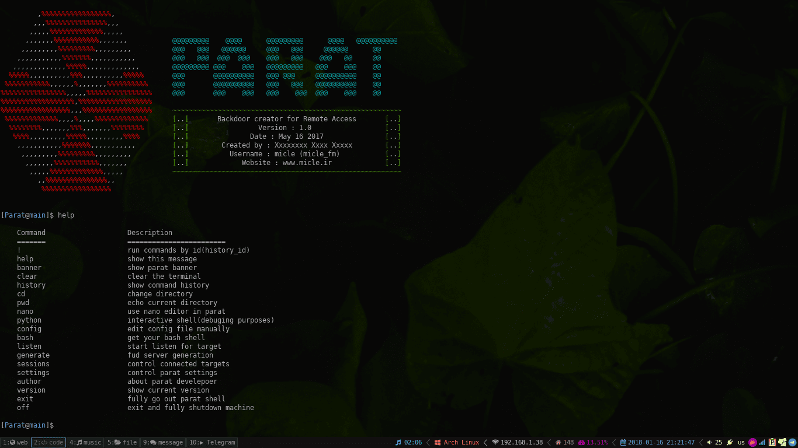

> Parat is NOT for real attacks. It simply designed for educational purposes only and so is not responsible for any abusive/offensive uses.

# Parat
Parat is a simple remote administration tool(RAT) written in python.
 Also you can read [wiki](https://github.com/micle-fm/Parat/wiki)!

### Do you want to try?
Copy and paste on your terminal: 
`git clone https://github.com/micle-fm/Parat && cd Parat && python main.py`
 
## Features
* Fully UnDetectable(FUD)
* Compatible with Telegram messanger
* Bypass windows User Account Control(UAC)
* Memory executation
* No any requirments to setup

### Telegram
You can communicate parat using telegram messanger. For this do steps:
1. Open `telegram.service` file by an editor
1. Insert your bot token on line 15, replaced on `YOUR_BOT_TOKEN`
1. Run `telegram.service` by typing: *python telegram.service*
1. Now you can use your bot to control parat :)
  A very simple bot for example exist on [@ParatKitBot](https://t.me/ParatKitBot). (Deactived)

  Feel free to share us your comment!
